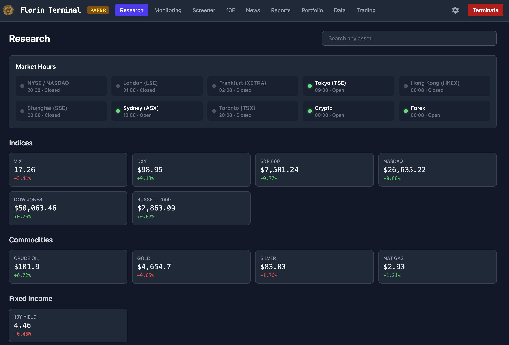
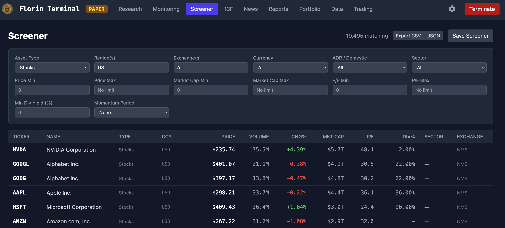
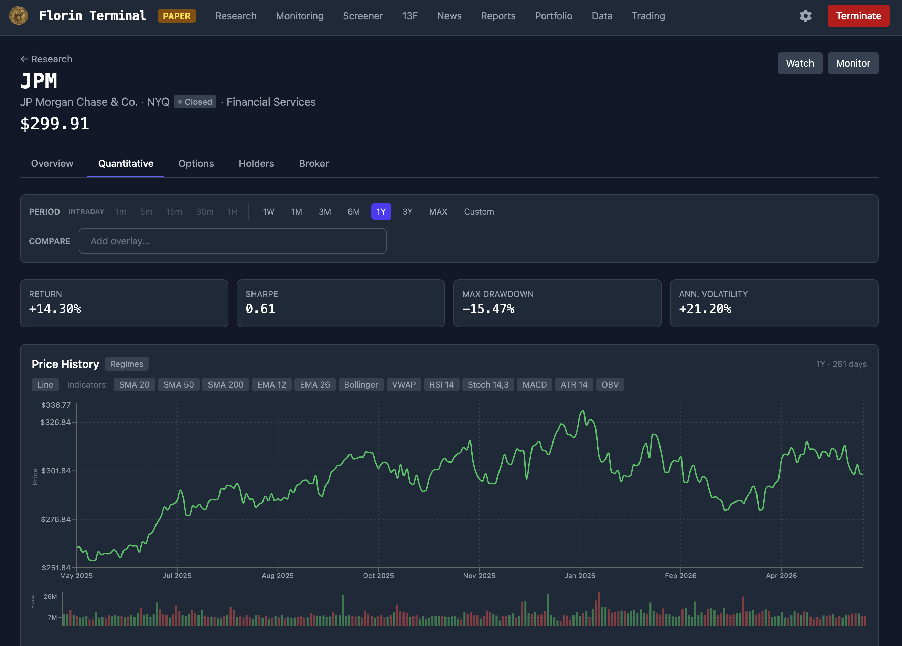
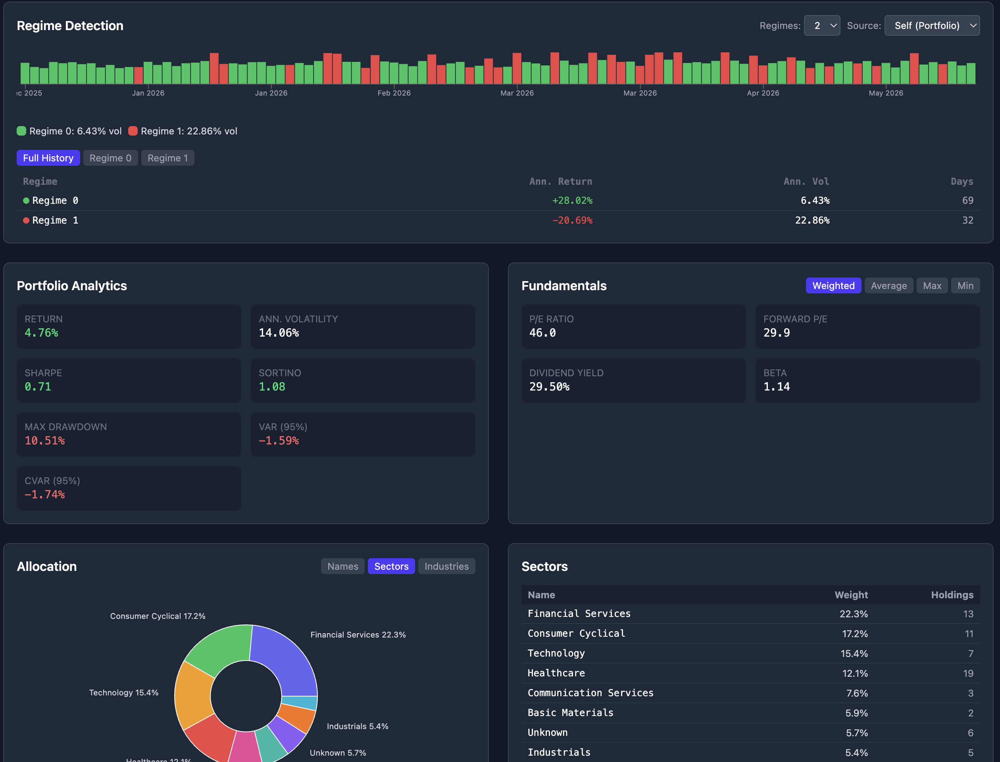

# Florin Terminal

<p align="center">
    
</p>

Florin is an AI-powered financial terminal for market monitoring, research, screening, portfolio analytics, and trading. It supports equities, ETFs, indices, mutual funds, and cryptocurrencies across 20+ global exchanges, with a web dashboard for research workflows and a Telegram bot for mobile alerts and trade commands.

## Contents

- [Florin Terminal](#florin-terminal)
  - [Contents](#contents)
  - [Overview](#overview)
  - [Visual Tour](#visual-tour)
    - [Markets Home](#markets-home)
    - [Screener](#screener)
    - [Asset Research](#asset-research)
    - [Portfolio Analytics](#portfolio-analytics)
  - [Features](#features)
    - [Research and Market Intelligence](#research-and-market-intelligence)
    - [Screening and Monitoring](#screening-and-monitoring)
    - [Portfolio and Trading](#portfolio-and-trading)
    - [AI and Alerts](#ai-and-alerts)
  - [Quick Start](#quick-start)
  - [Prerequisites](#prerequisites)
  - [Configuration](#configuration)
    - [Market Data](#market-data)
    - [Broker](#broker)
    - [LLM Providers](#llm-providers)
    - [Trading Defaults](#trading-defaults)
    - [Telegram and Sentiment Sources](#telegram-and-sentiment-sources)
  - [Running Locally](#running-locally)
  - [Docker](#docker)
  - [Dashboard Dev Mode](#dashboard-dev-mode)
  - [Telegram Bot](#telegram-bot)
    - [Bot Commands](#bot-commands)
  - [Architecture](#architecture)
    - [Dashboard Navigation](#dashboard-navigation)
  - [API Documentation](#api-documentation)
  - [Paper Trading](#paper-trading)
  - [Technology Stack](#technology-stack)

## Overview

Florin combines live and historical market data, screening, LLM-assisted analysis, risk analytics, portfolio tooling, and broker integration in one local terminal. The backend is a FastAPI service that starts the data, alerting, trading, Telegram, and dashboard services together. The frontend is a React dashboard served by the same FastAPI app in production.

The default trading mode is paper trading. Trading 212 support is available for demo or live accounts when configured.

## Visual Tour

### Markets Home

Headline market information and news is available from the home view.



### Screener

The screener supports multi-asset filters, regional exchange selection, saved configurations, and alert workflows.



### Asset Research

The research view combines price history, quantitative metrics, news, ownership, options, and LLM analysis for individual assets.



### Portfolio Analytics

Portfolio pages show allocation, performance, risk, and dependency statistics for custom portfolios.



## Features

### Research and Market Intelligence

- Asset search across equities, ETFs, indices, mutual funds, and cryptocurrencies
- Cumulative return charts with comparison overlays
- Intraday and daily data with configurable periods from 1 minute to monthly
- Options chain viewer with Greeks
- Risk metrics including Sharpe ratio, max drawdown, annualised volatility, VaR, and CVaR
- Regime detection using Markov switching regression
- Short interest, insider activity, institutional holders, news, sentiment, and web search
- Market breadth, economic calendar, earnings calendar, yield curves, and cross-asset correlation views

### Screening and Monitoring

- Multi-asset screener for stocks, ETFs, indices, mutual funds, and crypto
- Region, exchange, OTC tier, ADR, momentum, price, volume, and market-cap filters
- Saved screener configurations with Telegram alerts
- Watchlist notes, targets, live monitor polling, sparklines, and price alerts

### Portfolio and Trading

- Custom portfolios with weighted holdings
- Portfolio analytics including correlation, dependency modelling, returns analysis, benchmark comparison, and risk decomposition
- Paper broker by default, with Trading 212 integration for demo or live accounts
- Market, limit, and stop-loss orders
- Position monitoring, trade history, P&L charts, and performance statistics

### AI and Alerts

- LLM-powered announcement and sentiment analysis
- Single-model or multi-LLM consensus modes
- Provider support for Groq, Gemini, Claude CLI, and OpenRouter
- Telegram bot for alerts, account status, position checks, and trade commands

## Quick Start

```bash
./setup.sh
```

On Windows:

```bash
setup.bat
```

Start Florin:

```bash
uv run python main.py
```

Open the dashboard at `http://localhost:8000` and configure API keys from the Settings page.

## Prerequisites

| Requirement | Version | Notes |
|---|---:|---|
| uv | Latest | Required for the locked Python environment. Install from [docs.astral.sh](https://docs.astral.sh/uv/getting-started/installation/). |
| Python | 3.13 | Auto-provisioned by uv from `.python-version`. |
| Node.js | 18+ | Required for dashboard UI builds and development mode. |

Dependencies are pinned in `uv.lock`, so `uv sync --frozen` reproduces the project environment. The setup scripts can fall back to `python -m venv` and `pip` if `uv` is not installed, but that path is not lockfile-reproducible.

## Configuration

Settings can be configured from the dashboard Settings page at `http://localhost:8000/settings`, through environment variables, or through a local `.env` file.

### Market Data

| Variable | Description | Notes |
|---|---|---|
| `ALPACA_API_KEY` | Alpaca real-time market data key | Free tier available from [alpaca.markets](https://alpaca.markets). |
| `ALPACA_API_SECRET` | Alpaca API secret | Required with `ALPACA_API_KEY`. |
| `ALPACA_FEED` | Alpaca feed selection | Defaults to `iex`; use `sip` for paid SIP access. |

yfinance is used automatically for historical data, asset metadata, screening, and enrichment.

### Broker

| Variable | Description | Notes |
|---|---|---|
| `T212_API_KEY` | Trading 212 API key | Leave unset to use the paper broker. |
| `T212_API_SECRET` | Trading 212 API secret | Required for Trading 212 integration when applicable. |
| `T212_ENVIRONMENT` | `demo` or `live` | Use `demo` before live trading. |

### LLM Providers

| Variable | Description |
|---|---|
| `GROQ_API_KEY` | Groq cloud LLM API key |
| `GEMINI_API_KEY` | Google Gemini API key |
| `ANTHROPIC_API_KEY` | Optional Anthropic API key. Claude CLI auth is also supported through `claude login`. |
| `OPENROUTER_API_KEY` | OpenRouter API key |
| `LLM_MODE` | `single` or `consensus` |
| `LLM_DEFAULT_PROVIDER` | Provider used in single-model mode |
| `LLM_CONSENSUS_META_PROVIDER` | Provider used to synthesise consensus output |

Models can also be managed dynamically from the Settings UI through the LLM model registry.

### Trading Defaults

| Variable | Default | Description |
|---|---:|---|
| `PAPER_TRADING` | `true` | Must be explicitly set to `false` for live trading. |
| `DEFAULT_POSITION_SIZE` | `100.0` | Default position size. |
| `POSITION_SIZE_UNIT` | `gbp` | `gbp`, `usd`, or `shares`. |
| `DEFAULT_STOP_LOSS_PCT` | `10.0` | Default stop-loss threshold. |
| `MAX_OPEN_POSITIONS` | `10` | Maximum concurrent open positions. |

### Telegram and Sentiment Sources

| Variable | Description |
|---|---|
| `TELEGRAM_BOT_TOKEN` | Telegram bot token from BotFather |
| `TELEGRAM_CHAT_ID` | Personal Telegram chat ID |
| `REDDIT_CLIENT_ID` | Reddit API client ID |
| `REDDIT_CLIENT_SECRET` | Reddit API client secret |
| `REDDIT_USER_AGENT` | Reddit API user agent, for example `florin-terminal/0.2 by u/you` |

## Running Locally

```bash
uv run python main.py
```

Or double-click `Florin.command` on macOS or `Florin.bat` on Windows.

The app starts all core services concurrently:

- Market data providers
- Screener alert service
- Alert processing pipeline
- Position monitoring
- Market breadth scanner
- Economic calendar refresh service
- Telegram bot when configured
- Web dashboard on port `8000`
- WebSocket event bridge at `/ws`

## Docker

```bash
docker compose up -d
```

Open `http://your-server:8000` and configure API keys from the Settings page.

## Dashboard Dev Mode

For frontend development with hot reload, start the backend and frontend separately:

```bash
# Terminal 1: backend
uv run python main.py
```

```bash
# Terminal 2: frontend
cd dashboard_ui
npm run dev
```

The frontend dev server runs at `http://localhost:5173` and proxies `/api` and `/ws` traffic to the backend on port `8000`.

After frontend changes, build the production dashboard:

```bash
cd dashboard_ui
npm run build
```

## Telegram Bot

1. Message [@BotFather](https://t.me/BotFather) and create a bot with `/newbot`.
2. Add the bot token as `TELEGRAM_BOT_TOKEN`.
3. Message [@userinfobot](https://t.me/userinfobot) to get your chat ID.
4. Add the chat ID as `TELEGRAM_CHAT_ID`.
5. Start a conversation with your bot and send `/start`.

### Bot Commands

| Command | Description |
|---|---|
| `/start` | Welcome message and command help |
| `/status` | System health overview |
| `/balance` | Account balance and P&L |
| `/positions` | Open positions with live P&L |
| `/settings` | View current configuration |
| `/mode` | Current LLM mode |
| `/kill` | Emergency stop that cancels pending orders |
| `/buy TICKER [size]` | Place a buy order, for example `/buy AAPL £50` |

The bot can send automatic alerts when screener matches or momentum signals are found, including LLM analysis and interactive trade actions.

## Architecture

```text
main.py                  # Florin orchestrator
config/                  # Settings, constants, and environment handling
core/                    # Event bus, Pydantic models, logging, market hours
data/                    # Market data providers
scanner/                 # Screener alerts and market breadth scanning
sentiment/               # News, Reddit, SEC, ApeWisdom, Alpha Vantage, and web search
analysis/                # LLM providers, consensus, and report generation
broker/                  # Trading 212 and paper broker implementations
telegram_bot/            # aiogram bot commands and alert handlers
stats/                   # Statistical models and risk metrics
dashboard/               # FastAPI REST API, WebSocket, and built frontend
dashboard_ui/            # React, Vite, TailwindCSS frontend source
db/                      # SQLAlchemy async ORM and Alembic migrations
tests/                   # pytest and pytest-asyncio test suite
```

### Dashboard Navigation

| Area | Path | Description |
|---|---|---|
| Research | `/` | Asset search and detailed research tabs |
| Monitoring | `/monitoring` | Watchlists and live price monitoring |
| Screener | `/screener` | Multi-asset screening and saved configurations |
| 13F Filings | `/13f` | Institutional holdings search |
| News | `/news` | Feed, Economic Calendar, and Earnings sub-tabs |
| Reports | `/reports` | Generated LLM analysis reports |
| Portfolio | `/portfolio` | Custom portfolio analytics |
| Data | `/data` | Historical data download |
| Trading | `/trading` | Account, orders, trades, stats, and trading settings |
| Settings | `/settings` | System configuration |

`/calendar` redirects to `/news/economic`.

## API Documentation

Interactive API documentation is available at `http://localhost:8000/api/docs` when the server is running. The API exposes 80+ endpoints across the dashboard route modules.

## Paper Trading

Leave `T212_API_KEY` unconfigured to use the paper broker. It simulates execution at current market prices, tracks virtual positions and P&L in memory, starts with £10,000 virtual capital, and applies the same position limits and stop-loss rules used by live trading.

## Technology Stack

- **Backend:** Python 3.13, FastAPI, SQLAlchemy 2.0 async, SQLite WAL mode, Alembic
- **Frontend:** React 19, Vite 8, TailwindCSS 4, React Router 7, Recharts
- **Real-time:** WebSocket at `/ws`, async EventBus pub/sub
- **Market data:** Alpaca, yfinance, BIS, ECB, BOC, Alpha Vantage, Finnhub
- **LLM:** Groq, Gemini, Claude CLI, OpenRouter
- **Statistical:** statsmodels, copulax
- **Telegram:** aiogram 3.x
- **Tests:** 600+ pytest and pytest-asyncio tests
